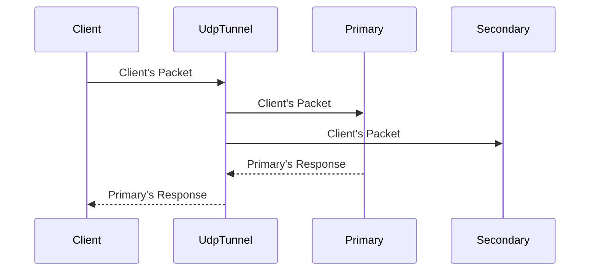

# udp_tunnel

Application for tunneling UDP traffic between two hosts with function of mirroring
input traffic to secondary address.

[CHANGELOG](https://github.com/Cykooz/udp_tunnel/blob/main/CHANGELOG.md)

## How it works

## Environment variables

**LISTEN_ADDR**  
Address to listen for incoming UDP packets.  
Default: `0.0.0.0:53`.

**PRIMARY_ADDR**  
Primary address (<host>:<port>) for sending UDP packets that have been sent by
the client to `LISTEN_ADDR`.  
All packets received from this address will be sent back to the client.  
Default: `8.8.8.8:53`.

**SECONDARY_ADDR**  
Secondary address (<host>:<port>) for sending UDP packets that have been sent by
the client to `LISTEN_ADDR`.  
Packets received from this address are ignored.  
Default: `192.168.0.1:53`.

**KEEPALIVE_TIMEOUT**  
Keepalive timeout in milliseconds.  
This timeout is used to keep mapping between the client's port that is used
to send packets to `LISTEN_ADDR` and the port that is used to send these
packets to `PRIMARY_ADDR`.  
Default: `500`.

**LOG_LEVEL**  
Maximal level of log messages. Available values: `debug`, `info`, `error`.  
Default: `info`.

**WITHOUT_ANSI_COLOR**  
Disable ANSI color in log messages.
